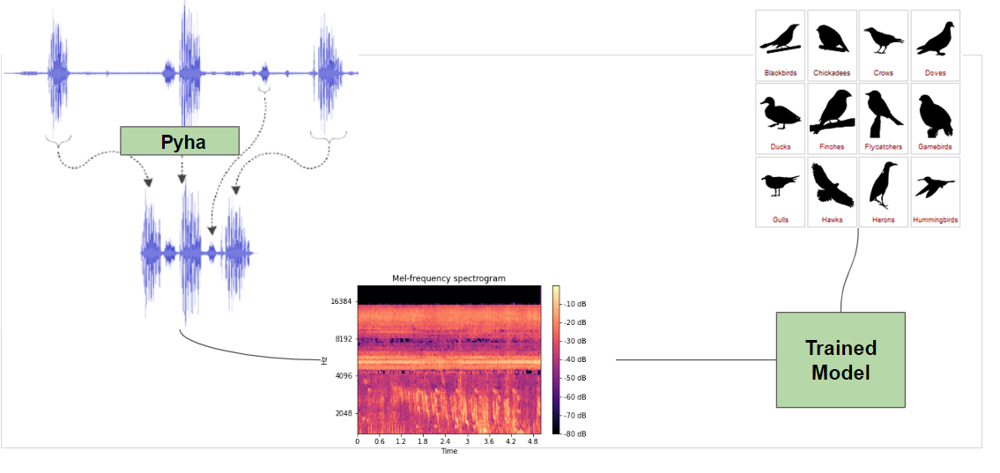
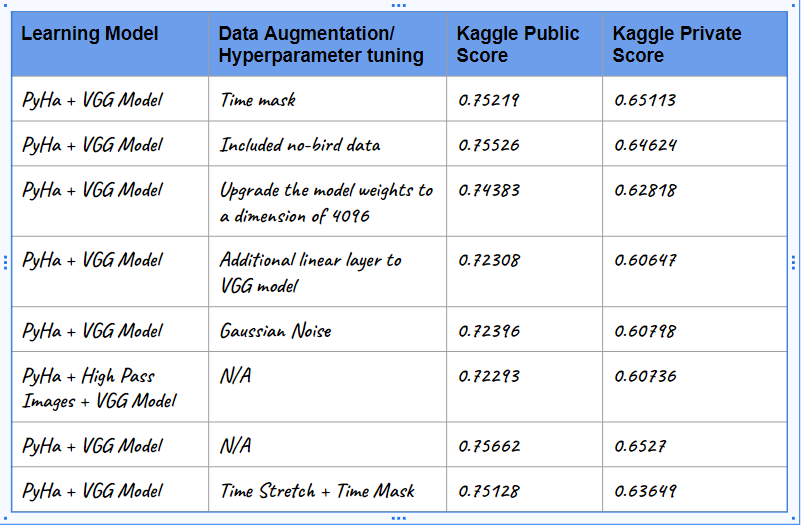

# Acoustic Species Identification

Birds can serve as effective indicators of changes in biodiversity due to their mobility and diverse habitat needs. The alterations in the species composition and bird population can reflect the progress or shortcomings of restoration projects. However, conventional bird biodiversity surveys relying on observer-based methods are often difficult and expensive to conduct over extensive areas. Alternatively, using audio recording devices combined with modern analytical techniques that employ machine learning can enable conservationists to study the correlation between restoration interventions and biodiversity in greater depth by sampling larger spatial scales with higher temporal resolution. Ultimately, the optimal objective is to create a pipeline capable of precisely detecting a wide range of species vocalizations within a specified location where audio equipment is installed.

Our team's MVP was to design and implement a solution for analyzing audio data to identify different bird species based on their distinct calls. By utilizing machine learning techniques, we aim to create a powerful model that can accurately recognize and predict the species of birds present in the audio recordings. We successfully accomplished this.

The proposed end product of this project is a robust and efficient multi-species classifier that can seamlessly process audio data and identify the bird species present in the recordings. Our solution will use melspectogram to represent features from the audio data, which will then be used to train the machine learning model.

## Data Set:

The train data contains 264 species from Kenya, Africa, and the test set consists of 191 10-minute soundscapes. Xeno-canto provided 16,900 audio recordings which can be used to train a classifier. This data is part of the [BirdClef]{} 2023 Kaggle competition.

## Methodology 

[PyHa](https://github.com/UCSD-E4E/PyHa): 
A tool designed to convert audio-based "weak" labels to "strong" moment-to-moment labels. We are using the TweetyNet model variant to identify bird calls in the audio clip.

This package is being developed and maintained by the [Engineers for Exploration Acoustic Species Identification Team](http://e4e.ucsd.edu/acoustic-species-identification) in collaboration with the [San Diego Zoo Wildlife Alliance](https://sandiegozoowildlifealliance.org/).

**Step 1:** Audio data is sent to PyHA, a platform capable of processing audio signals, in order to obtain a set of 5 second audio segments. These segments will be analyzed to determine the presence or absence of bird sounds and data frames will be generated.

**Step 2:**  To visualize and analyze this data, we utilized the librosa library, which offers a range of audio processing functionalities. In particular, we employed librosa to generate melspectrograms for the data frames.

**Step 3:** To initiate our analysis, we adopted a random selection process to choose 30 classes from the available data. The purpose of this selection was to generate melspectrogram images for the corresponding data frames derived from the PyHa output. By selecting a diverse set of 30 classes, we aimed to obtain a representative sample of the dataset, encompassing various bird species and vocalizations.The rationale behind choosing 30 classes was to facilitate a comparative evaluation of different models. By utilizing the melspectrogram images, we could assess the performance of these models using a range of metrics. The goal was to identify and select the models that exhibited the highest performance across these metrics. By comparing the models based on various evaluation criteria, such as accuracy, precision, recall, F1 score, or any other relevant metrics, we aimed to gain insights into the strengths and weaknesses of each model. 

The models we chose were: **VGG16, EfficientNet Model - B0, B3, B7,  Resnet50**.

**VGG16**: The validation accuracy achieved on the 30 classes was 89.06%. The macro average precision was determined to be 78.2%.

**EfficientNet**: The validation accuracy achieved on the 30 classes for efficientNet B0 model was 74.35%, for efficientNet B3 model was 64.36% and for efficientNet B7 model was 38.01% . The macro average precision was determined to be 78.2% for efficientNet B0 model, 74.60% for efficientNet B3 model and 44.06% for efficientNet B7 model.

**Resnet50**:  The validation accuracy achieved was only 36%.

## Data Augmentation Techniques

**Noise Reduction:** We employed noise reduction techniques to minimize background noise and enhance the clarity of the melspectrogram images. By reducing unwanted noise, we aimed to improve the model's ability to focus on relevant audio patterns and features.  We achieved a validation accuracy of 83.19%.

**Time Masking:** Time masking involves masking consecutive time steps in the melspectrogram image, effectively introducing temporal gaps. This technique helps the model generalize better and be less reliant on specific temporal dependencies in the training data.

**Frequency Masking:** Similar to time masking, frequency masking involves masking consecutive frequency bins in the melspectrogram image. This technique encourages the model to focus on different frequency components and reduces overfitting to specific frequency patterns.

**Time Stretch:** Time stretching is a common technique used in audio data augmentation to alter the duration of an audio signal without changing its pitch. It can be useful for tasks such as speech recognition, audio classification, and music analysis. We randomized Time masking, Time stretch and Frequency masking among the dataset during training and validation and achieved a valdation accuracy of 94.62%.

**Pitch Shift:** By applying pitch shifting, we altered the pitch or tonal characteristics of the audio signals. This transformation simulates variations in pitch that can occur naturally in different recordings or environments. It allows the model to learn robust representations that are invariant to slight pitch variations.  We achieved a validation accuracy of 81.59%.

**Gaussian Noise:** Adding Gaussian noise to the melspectrogram images introduced random variations that mimic real-world recording conditions. By doing so, we aimed to improve the model's resilience to noise and enhance its ability to generalize well in the presence of unexpected acoustic variations. We achieved a validation accuracy of 85.59%.

## Kaggle Final Results

